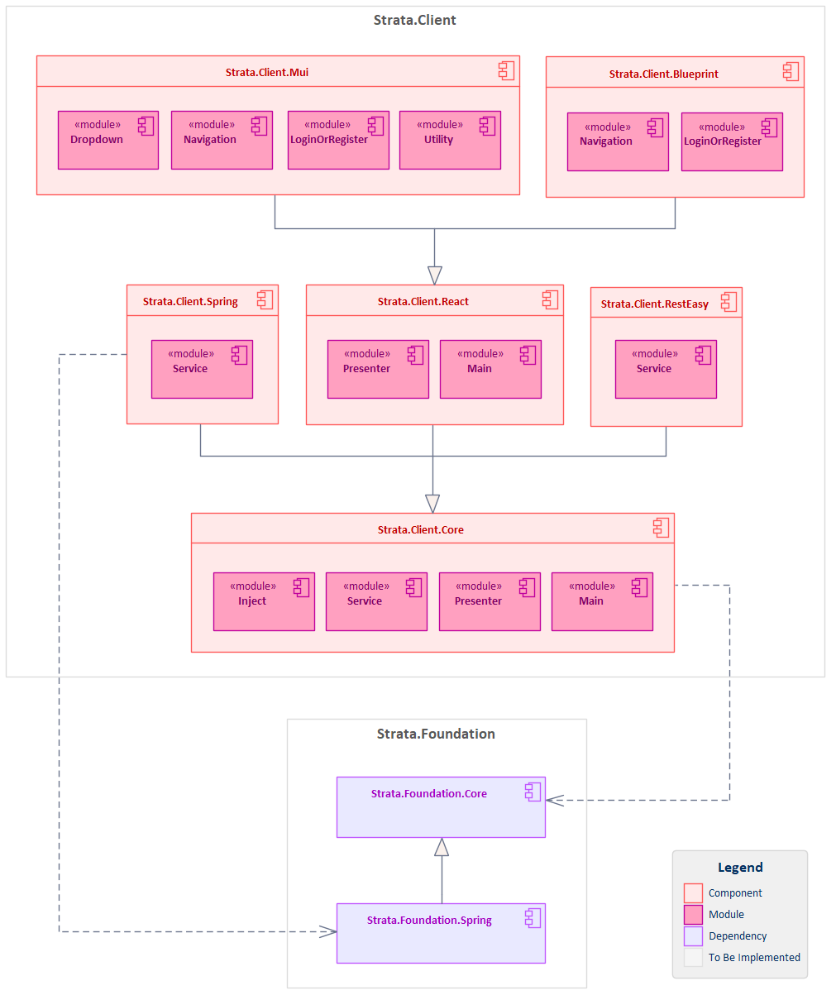

[]()
[]()

Client-side components and utilities for building robust, scalable enterprise client applications in the Strata Framework Set. This library provides Model-View-Presenter (MVP) architecture, React integration, UI component libraries, and client-side patterns for building high-performance client applications.

## Features

- **MVP Architecture**: Model-View-Presenter pattern implementation with clean separation of concerns
- **Multi-Platform Support**: TypeScript/JavaScript and Java client components with cross-platform compatibility
- **React Integration**: Enhanced React components with MVP pattern integration and state management
- **UI Component Libraries**: Material-UI and Blueprint.js integration with MVP-aware components
- **State Management**: Centralized model store with reactive updates and presenter coordination
- **Spring Client Integration**: REST client abstractions with reactive and traditional HTTP support
- **Component Framework**: Modular component architecture for scalable client application development
- **Testing Support**: Comprehensive testing utilities and fixtures for client components

## Architecture

The Strata.Client framework follows a modular architecture with clear separation of concerns:



Each component builds upon the core MVP abstractions while providing specialized functionality for specific client-side use cases and UI frameworks.

## Components

### Strata.Client.Core

The foundational client component that provides essential MVP abstractions and utilities for enterprise client application development:

**Java Modules:**
- `strata.client.core.main` - Core application abstractions and lifecycle management
  - IApplication interface for application contracts
  - AbstractApplication base class for MVP application implementations
- `strata.client.core.presenter` - MVP pattern implementations
  - IPresenter interface for Model-View-Presenter coordination
  - AbstractPresenter base class for presenter implementations
  - IModelStore interface for centralized state management
  - ModelStore implementation with reactive updates
  - IUpdatable interface for component lifecycle management
  - AbstractUpdatable base class for updatable components
  - IViewCreator interface for view instantiation abstractions
  - IAction and Action implementations for command pattern support
  - SimpleAction for basic action implementations
- `strata.client.core.service` - HTTP client abstractions and REST service communication
  - AbstractRestClient for REST API communication
  - IResponse interface for HTTP response handling
  - StandardResponse implementation for standard HTTP responses
  - IResponseProcessor interface for response processing
  - StandardResponseProcessor for standard response handling
  - IHeadersConsumer interface for HTTP header management
- `strata.client.core.inject` - Dependency injection and configuration abstractions
  - IBaseUrlProvider interface for base URL configuration
  - PropertiesBasedBaseUrlProvider for properties-based URL configuration

**TypeScript Modules:**
- `Main` - Core application abstractions
  - AbstractApplication for application lifecycle management
  - IApplication interface for application contracts
- `Presenter` - MVP pattern implementations in TypeScript
  - AbstractPresenter base class for presenter implementations
  - AbstractUpdatable base class for updatable components
  - IPresenter, IModelStore, IUpdatable interfaces
  - ModelStore implementation with reactive state management
  - Action and SimpleAction for command pattern support
  - IView, IViewVisitor, IPresentable interfaces for view abstractions
- `Serialization` - Browser storage abstractions
  - LocalStorageObjectReader and LocalStorageObjectWriter for localStorage integration
  - SessionStorageObjectReader and SessionStorageObjectWriter for sessionStorage integration
- `Service` - HTTP client abstractions
  - AbstractRestClient for REST API communication
  - IResponse, IResponseProcessor for response handling
  - ServiceError for error management
  - StandardResponse and StandardResponseProcessor implementations
  - IHeadersConsumer for HTTP header management

### Strata.Client.React

React Framework integration component that extends core MVP abstractions with React-specific implementations:

**TypeScript Modules:**
- `Main` - React application integration
  - ReactApplication component for React-based applications
- `Presenter` - React-specific presenter implementations
  - PresenterView component for React MVP integration
  - RenderableView for component rendering abstractions
  - IPresenterViewProperty for presenter-view property binding
  - IRenderable and IRenderableViewProperty for rendering contracts

### Strata.Client.Mui

Material-UI integration component providing Material Design components with MVP pattern support:

**TypeScript Modules:**
- `Dropdown` - Material-UI dropdown components with MVP integration
- `LoginOrRegister` - Authentication UI components using Material Design
- `Navigation` - Material-UI navigation components and menu systems
- `Utility` - Material-UI utility functions and helper components

### Strata.Client.Blueprint

Blueprint.js integration component providing desktop-focused UI components with MVP pattern support:

**TypeScript Modules:**
- `LoginOrRegister` - Authentication UI components using Blueprint.js design system
- `Navigation` - Blueprint.js navigation components optimized for desktop applications

### Strata.Client.Spring

Spring Framework integration component for client-side REST communication and service integration:

**Java Modules:**
- `strata.client.spring.service` - REST client abstractions
  - AbstractSpringRestClient for traditional HTTP operations
  - AbstractReactiveRestClient for reactive HTTP operations
  - Service configuration and client setup utilities
  - Error handling and response processing

## Installation

### Gradle

Add the following dependencies to your `build.gradle`:

```gradle
dependencies {
    implementation 'strata.client:strata-client-core:1.0-SNAPSHOT'
    implementation 'strata.client:strata-client-react:1.0-SNAPSHOT'
    implementation 'strata.client:strata-client-mui:1.0-SNAPSHOT'
    implementation 'strata.client:strata-client-blueprint:1.0-SNAPSHOT'
    implementation 'strata.client:strata-client-spring:1.0-SNAPSHOT'

    // For testing
    testImplementation 'strata.client:strata-client-core-test:1.0-SNAPSHOT'
    testImplementation 'strata.client:strata-client-react-test:1.0-SNAPSHOT'
}
```

### npm/yarn

Add the following dependencies to your `package.json`:

```json
{
  "dependencies": {
    "strata.client.core": "0.0.0-snapshot",
    "strata.client.react": "0.0.0-snapshot",
    "strata.client.mui": "0.0.0-snapshot",
    "strata.client.blueprint": "0.0.0-snapshot"
  }
}
```

Install with yarn:
```bash
yarn install
```

### Repository Configuration

This package is published to GitHub Packages. Add the repository to your build configuration:

```gradle
repositories {
    maven {
        name "GitHubPackages"
        url "https://maven.pkg.github.com/StrataFrameworkSet/repository"
        credentials {
            username = project.findProperty("gpr.user") ?: System.getenv("USERNAME")
            password = project.findProperty("gpr.key") ?: System.getenv("TOKEN")
        }
    }
}
```

## Usage

### Basic MVP Application Setup

```java
import strata.client.core.presenter.IPresenter;
import strata.client.core.presenter.IModelStore;
import strata.client.core.presenter.ModelStore;
import strata.client.core.presenter.AbstractPresenter;

// Define your presenter extending AbstractPresenter
public class CustomerPresenter 
    extends AbstractPresenter<CustomerModel, CustomerView>
    implements IPresenter<CustomerModel, CustomerView>
{
    public
    CustomerPresenter(
        IModelStore modelStore)
    {
        super(modelStore, CustomerModel.class);
        setView(new CustomerView());
    }

    @Override
    public void
    start()
    {
        super.start();
        getView().initialize();
    }

    @Override
    public void
    stop()
    {
        getView().cleanup();
        super.stop();
    }

    @Override
    protected void
    doUpdate(CustomerView view, CustomerModel model)
    {
        view.updateDisplay(model);
    }
}
```

### TypeScript MVP Implementation

```typescript
import {IPresenter} from 'strata.client.core/Presenter';
import {IModelStore} from 'strata.client.core/Presenter';
import {AbstractPresenter} from 'strata.client.core/Presenter';

export
class CustomerPresenter
    extends AbstractPresenter<CustomerModel, CustomerView>
    implements IPresenter<CustomerModel, CustomerView>
{
    constructor(
        modelStore: IModelStore)
    {
        super(modelStore, "Customer");
        this.setView(new CustomerView());
    }

    start(): void
    {
        super.start();
        this.getView().initialize();
    }

    stop(): void
    {
        this.getView().cleanup();
        super.stop();
    }

    protected
    doUpdate(view: CustomerView, model: CustomerModel): void
    {
        view.updateDisplay(model);
    }
}
```

### React Class Component Integration

```typescript
import * as React from "react";
import {PresenterView} from "strata.client.react/Presenter";
import {ICustomerPresenter} from "./ICustomerPresenter";
import {ICustomerView} from "./ICustomerView";
import {ICustomerViewProperty} from "./ICustomerViewProperty";
import Element = React.JSX.Element;

export
class CustomerView
    extends PresenterView<ICustomerView, ICustomerPresenter, ICustomerViewProperty>
    implements ICustomerView
{
    private itsCustomerName: string = "";
    private itsCustomerEmail: string = "";

    constructor(props: ICustomerViewProperty)
    {
        super(props);
    }

    render(): Element
    {
        return (
            <div className="customer-container">
                <h1>{this.itsCustomerName || 'Loading...'}</h1>
                <p>{this.itsCustomerEmail}</p>
                <button onClick={() => this.handleRefresh()}>
                    Refresh
                </button>
            </div>
        );
    }

    setCustomerName(name: string): void
    {
        this.itsCustomerName = name;
        this.forceUpdate();
    }

    setCustomerEmail(email: string): void
    {
        this.itsCustomerEmail = email;
        this.forceUpdate();
    }

    protected
    getSelf(): ICustomerView
    {
        return this;
    }

    private
    handleRefresh(): void
    {
        this.props.presenter.refreshCustomer();
    }
}
```

### Material-UI Class Component Integration

```typescript
import * as React from "react";
import {Button, TextField, Paper} from '@mui/material';
import {PresenterView} from "strata.client.react/Presenter";
import {ICustomerFormPresenter} from "./ICustomerFormPresenter";
import {ICustomerFormView} from "./ICustomerFormView";
import {ICustomerFormViewProperty} from "./ICustomerFormViewProperty";
import Element = React.JSX.Element;

export
class CustomerFormView
    extends PresenterView<ICustomerFormView, ICustomerFormPresenter, ICustomerFormViewProperty>
    implements ICustomerFormView
{
    private itsCustomerName: string = "";
    private itsCustomerEmail: string = "";

    constructor(props: ICustomerFormViewProperty)
    {
        super(props);
    }

    render(): Element
    {
        return (
            <Paper elevation={2} style={{padding: 16}}>
                <TextField
                    label="Customer Name"
                    variant="outlined"
                    fullWidth
                    margin="normal"
                    value={this.itsCustomerName}
                    onChange={(event) => this.handleNameChange(event.target.value)}
                />
                <TextField
                    label="Email Address"
                    variant="outlined"
                    fullWidth
                    margin="normal"
                    type="email"
                    value={this.itsCustomerEmail}
                    onChange={(event) => this.handleEmailChange(event.target.value)}
                />
                <Button 
                    variant="contained"
                    color="primary"
                    onClick={() => this.handleSave()}
                >
                    Save Customer
                </Button>
            </Paper>
        );
    }

    setCustomerName(name: string): void
    {
        this.itsCustomerName = name;
        this.forceUpdate();
    }

    setCustomerEmail(email: string): void
    {
        this.itsCustomerEmail = email;
        this.forceUpdate();
    }

    getCustomerName(): string
    {
        return this.itsCustomerName;
    }

    getCustomerEmail(): string
    {
        return this.itsCustomerEmail;
    }

    protected
    getSelf(): ICustomerFormView
    {
        return this;
    }

    private
    handleNameChange(name: string): void
    {
        this.itsCustomerName = name;
        this.forceUpdate();
    }

    private
    handleEmailChange(email: string): void
    {
        this.itsCustomerEmail = email;
        this.forceUpdate();
    }

    private
    handleSave(): void
    {
        this.props.presenter.saveCustomer();
    }
}
```

### TypeScript Presenter with Dispatched Actions

```typescript
import {AbstractPresenter} from 'strata.client.core/Presenter';
import {IModelStore} from 'strata.client.core/Presenter';
import {Action} from 'strata.client.core/Presenter';
import {ICompletionStage} from 'strata.foundation.core/concurrent';
import {ICustomerService} from "../service/ICustomerService";
import {CustomerRestClient} from "../service/CustomerRestClient";

export
class CustomerPresenter
    extends AbstractPresenter<ICustomerModel, ICustomerView>
    implements ICustomerPresenter
{
    private itsService: ICustomerService;

    constructor(modelStore?: IModelStore)
    {
        super("Customer", modelStore);
        this.itsService = new CustomerRestClient("https://localhost:8080/customer-service");
    }

    protected
    doUpdate(view: ICustomerView, model: ICustomerModel): void
    {
        view.setCustomerName(model.getName());
        view.setCustomerEmail(model.getEmail());
    }

    saveCustomer(): void
    {
        let name: string = this.getView().getCustomerName();
        let email: string = this.getView().getCustomerEmail();

        this.dispatch(
            new Action<ICustomerModel>(
                this.getKey(),
                model => this.changeModel(model, name, email)));
    }

    refreshCustomer(): void
    {
        let customerId: string = this.getView().getCustomerId();

        this.dispatch(
            new Action<ICustomerModel>(
                this.getKey(),
                model => this.loadCustomer(model, customerId)));
    }

    private
    changeModel(
        model: ICustomerModel,
        name: string,
        email: string): ICompletionStage<ICustomerModel>
    {
        const request: SaveCustomerRequest =
            new SaveCustomerRequestBuilder()
                .setName(name)
                .setEmail(email)
                .build();

        console.log("CustomerPresenter.changeModel");
        return this
            .itsService
            .saveCustomerAsync(request)
            .thenApply(
                (customer: Customer) =>
                {
                    const updatedModel: ICustomerModel =
                        new CustomerModel()
                            .setName(customer.name)
                            .setEmail(customer.email)
                            .setId(customer.id);

                    console.log("Customer saved successfully: " + JSON.stringify(customer));
                    return updatedModel;
                })
            .exceptionally(
                (error: Error) =>
                {
                    const errorModel: ICustomerModel =
                        new CustomerModel()
                            .setName(name)
                            .setEmail(email)
                            .setErrorMessage(error.message);

                    console.log("Save customer failed: " + error.message);
                    return errorModel;
                });
    }

    private
    loadCustomer(
        model: ICustomerModel,
        customerId: string): ICompletionStage<ICustomerModel>
    {
        console.log("CustomerPresenter.loadCustomer");
        return this
            .itsService
            .getCustomerAsync(customerId)
            .thenApply(
                (customer: Customer) =>
                {
                    const loadedModel: ICustomerModel =
                        new CustomerModel()
                            .setName(customer.name)
                            .setEmail(customer.email)
                            .setId(customer.id);

                    console.log("Customer loaded successfully: " + JSON.stringify(customer));
                    return loadedModel;
                })
            .exceptionally(
                (error: Error) =>
                {
                    const errorModel: ICustomerModel =
                        new CustomerModel()
                            .setErrorMessage("Failed to load customer: " + error.message);

                    console.log("Load customer failed: " + error.message);
                    return errorModel;
                });
    }
}
```

### Spring REST Client Integration

```java
import strata.client.core.service.AbstractRestClient;
import javax.ws.rs.client.ClientBuilder;
import javax.net.ssl.SSLContext;
import org.apache.http.ssl.SSLContextBuilder;
import org.springframework.core.io.ClassPathResource;
import org.springframework.core.io.Resource;
import java.util.concurrent.CompletionStage;

public
class CustomerRestClient
    extends AbstractRestClient
    implements ICustomerService
{
    public
    CustomerRestClient(String baseUrl)
    {
        super(
            createBuilder(),
            preprocessBaseUrl(baseUrl),
            "customer-service/");
    }

    @Override
    public Customer
    getCustomerSync(String customerId)
    {
        return
            doGetAsync("customers/" + customerId, Customer.class)
                .toCompletableFuture()
                .join();
    }

    @Override
    public CompletionStage<Customer>
    getCustomerAsync(String customerId)
    {
        return
            doGetAsync("customers/" + customerId, Customer.class);
    }

    @Override
    public Customer
    saveCustomerSync(SaveCustomerRequest request)
    {
        return
            doPostAsync("customers", Customer.class, request)
                .toCompletableFuture()
                .join();
    }

    @Override
    public CompletionStage<Customer>
    saveCustomerAsync(SaveCustomerRequest request)
    {
        return
            doPostAsync("customers", Customer.class, request);
    }

    @Override
    public void
    deleteCustomerSync(String customerId)
    {
        doDeleteAsync("customers/" + customerId, Void.class)
            .toCompletableFuture()
            .join();
    }

    @Override
    public CompletionStage<Void>
    deleteCustomerAsync(String customerId)
    {
        return
            doDeleteAsync("customers/" + customerId, Void.class);
    }

    private static String
    preprocessBaseUrl(String baseUrl)
    {
        return
            baseUrl.endsWith("/")
                ? baseUrl
                : baseUrl + '/';
    }

    private static ClientBuilder
    createBuilder() throws RuntimeException
    {
        return
            ClientBuilder
                .newBuilder()
                .sslContext(createSslContext());
    }

    private static SSLContext
    createSslContext() throws RuntimeException
    {
        try
        {
            Resource keystore = new ClassPathResource("customer-service.p12");
            return
                new SSLContextBuilder()
                    .loadTrustMaterial(
                        keystore.getURL(),
                        "customer-service".toCharArray())
                    .build();
        }
        catch (Exception e)
        {
            throw new RuntimeException(e);
        }
    }
}
```

### Complete Application Setup

```typescript
import * as React from "react";
import {IApplication} from "strata.client.core/Main";
import {ReactApplication} from 'strata.client.react/Main';
import {IModelStore} from 'strata.client.core/Presenter';
import {ModelStore} from 'strata.client.core/Presenter';
import {CustomerModel} from "./Customer/CustomerModel";
import {MainModel} from "./Main/MainModel";
import {MainView} from "./Main/MainView";
import {IMainModel} from "./Main/IMainModel";
import {IMainPresenter} from "./Main/IMainPresenter";
import {IMainView} from "./Main/IMainView";
import {MainPresenter} from "./Main/MainPresenter";

export
class CustomerApplication
    extends ReactApplication<IMainModel, IMainView, IMainPresenter>
    implements IApplication
{
    constructor()
    {
        super();

        let modelStore: IModelStore =
            new ModelStore()
                .insert("Main", new MainModel())
                .insert("Customer", new CustomerModel());
        
        let presenter: IMainPresenter = new MainPresenter(modelStore);

        this.initialize(modelStore, presenter);
    }

    protected
    getMainView(): any
    {
        return (<MainView presenter={this.getPresenter()}/>);
    }
}
```

### Testing with Client Test Utilities

```java
import strata.client.core.presenter.ModelStore;
import strata.client.core.presenter.IModelStore;
import org.junit.jupiter.api.Test;
import org.junit.jupiter.api.BeforeEach;
import static org.mockito.Mockito.*;
import static org.junit.jupiter.api.Assertions.*;

public
class CustomerPresenterTest
{
    private CustomerModel itsTestModel;
    private CustomerView itsMockView;
    private IModelStore itsModelStore;
    private CustomerPresenter itsPresenter;

    @BeforeEach
    public void
    setUp()
    {
        itsTestModel = createTestCustomer();
        itsMockView = mock(CustomerView.class);
        itsModelStore = new ModelStore();
        itsPresenter = new CustomerPresenter(itsModelStore);
        itsPresenter.setView(itsMockView);
    }

    @Test
    public void
    testCustomerPresenterLifecycle()
    {
        // Act
        itsPresenter.start();
        itsModelStore.insert(CustomerModel.class, itsTestModel);
        itsPresenter.stop();

        // Assert
        verify(itsMockView).initialize();
        verify(itsMockView).updateDisplay(itsTestModel);
        verify(itsMockView).cleanup();
    }

    private CustomerModel
    createTestCustomer()
    {
        CustomerModel model = new CustomerModel();
        model.setName("John Doe");
        model.setEmail("john.doe@example.com");
        return model;
    }
}
```

## Building

### Prerequisites

- Java 11 or higher
- Node.js 16 or higher
- Yarn package manager
- Gradle 7.0 or higher

### Build Commands

```bash
# Build all components
yarn build

# Build specific components
yarn run build-strata-client-core
yarn run build-strata-client-react
yarn run build-strata-client-mui
yarn run build-strata-client-blueprint

# Build Java components
./gradlew build

# Run tests
yarn test
./gradlew test

# Clean build artifacts
yarn clean

# Publish to local repository
./gradlew publishToMavenLocal

# Publish to GitHub Packages (requires credentials)
./gradlew publish
```

### Project Structure

```
Strata.Client/
├── Applications/
│   └── strata.client.reacthello/    # React Hello World example application
├── Components/
│   ├── Strata.Client.Core/          # Core MVP framework and abstractions
│   ├── Strata.Client.React/         # React Framework integration
│   ├── Strata.Client.Mui/           # Material-UI component integration
│   ├── Strata.Client.Blueprint/     # Blueprint.js component integration
│   └── Strata.Client.Spring/        # Spring REST client integration
├── Tests/
│   └── Strata.Client.ReactTest/     # React testing framework and utilities
├── build.gradle                     # Root build configuration
├── package.json                     # Root package configuration
├── settings.gradle                  # Gradle settings
└── README.md                        # This file
```

## Contributing

We welcome contributions to the Strata.Client project! Please follow these guidelines:

1. **Fork the repository** and create your feature branch from `development`
2. **Follow the coding standards** established in the existing codebase
3. **Write tests** for your changes and ensure all existing tests pass
4. **Update documentation** as needed for your changes
5. **Submit a pull request** with a clear description of your changes

### Development Setup

1. Clone the repository:
   ```bash
   git clone https://github.com/StrataFrameworkSet/Strata.Client.git
   cd Strata.Client
   ```

2. Build the project:
   ```bash
   yarn install
   yarn build
   ./gradlew build
   ```

3. Run tests to ensure everything works:
   ```bash
   yarn test
   ./gradlew test
   ```

### Code Style

- Follow Java and TypeScript naming conventions
- Use meaningful variable and method names
- Add appropriate JavaDoc/TSDoc comments for public APIs
- Maintain consistent indentation and formatting
- Write comprehensive unit tests for new functionality
- Follow MVP architectural patterns consistently
- **Interface Naming**: Prefix all interfaces with "I" (e.g., `IPresenter`, `IModelStore`, `ICustomerService`)
- **Method Chaining**: Setters should return reference to "this" to enable fluent method chaining

## License

This project is licensed under the Apache License 2.0 - see the [LICENSE](LICENSE) file for details.

## Support

For questions, issues, or contributions, please:

1. Check the [Issues](https://github.com/StrataFrameworkSet/Strata.Client/issues) page for existing questions
2. Create a new issue if your question hasn't been addressed
3. For development discussions, join our community channels

## Related Projects

- [Strata.Foundation](https://github.com/StrataFrameworkSet/Strata.Foundation) - Foundational components and utilities
- [Strata.Server](https://github.com/StrataFrameworkSet/Strata.Server) - Server-side components and utilities

---

**Strata.Client** is part of the Strata Framework Set, providing enterprise-grade client-side components for building scalable, maintainable applications.
